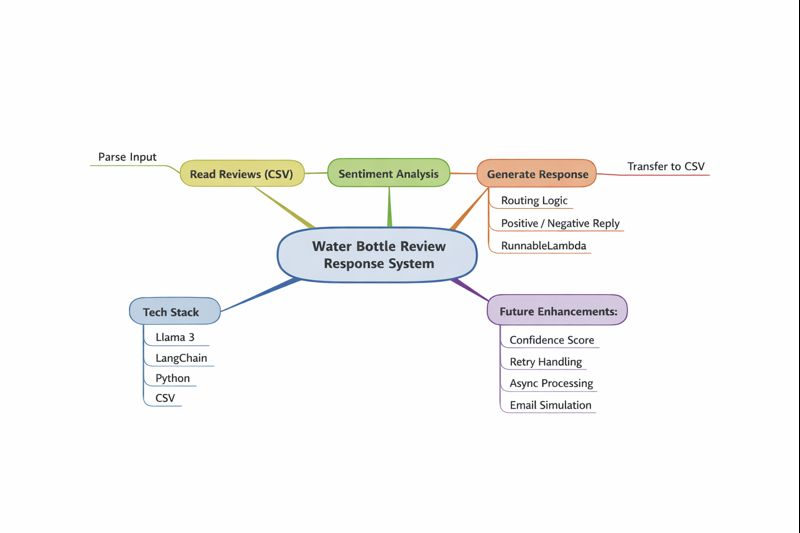

# GenAI Customer Review Response System 🚀

An end-to-end **GenAI mini project** that automatically reads customer reviews, classifies sentiment using **LLaMA 3.2 (Ollama)**, routes them deterministically, generates appropriate responses, and saves the results back to a CSV file.

This project is designed to be **beginner-friendly**, while following **real-world GenAI engineering best practices**.

---

## 📌 Project Use Case

**Product**: Water Bottle  
**Input**: Customer reviews (CSV)  
**Output**: AI-generated customer responses (CSV)

The system:
- Thanks customers for positive reviews
- Apologizes and offers support for negative reviews

---

## 🧠 Key Learning Objectives

- How to use LLMs correctly (text generation only)
- How to keep decision-making deterministic
- How RunnableLambda fits into LangChain
- How to design a transparent GenAI pipeline
- How to manage identity across LLM calls

---

## 🛠️ Tech Stack

- **Python**
- **LangChain**
- **Ollama**
- **Model**: `llama3.2:latest`
- **Data Format**: CSV

---

## 🏗️ Architecture Overview

```
┌──────────────────────────┐
│   Input CSV File         │
│ water_bottle_reviews.csv │
└────────────┬─────────────┘
             ↓
┌──────────────────────────┐
│ Step 2: Read CSV         │
│ Python Dict per Review   │
└────────────┬─────────────┘
             ↓
┌──────────────────────────┐
│ Step 3: Sentiment        │
│ Classification (LLM)     │
│ positive / negative      │
└────────────┬─────────────┘
             ↓
┌──────────────────────────┐
│ Step 4: Routing          │
│ RunnableLambda (if/else) │
└───────┬──────────┬───────┘
        ↓          ↓
┌─────────────┐  ┌─────────────┐
│ Positive    │  │ Negative    │
│ Response LLM│  │ Response LLM│
└───────┬─────┘  └───────┬─────┘
        ↓                ↓
┌──────────────────────────┐
│ Step 5: Save Output CSV  │
│ with AI Responses        │
└──────────────────────────┘
```



### Diagram Notes
- **LLMs are stateless** and operate on one review at a time
- **Python controls the flow**, not the LLM
- Routing is deterministic and safe

---

## 📂 Input CSV Format

**File**: `water_bottle_reviews.csv`

| Column | Description |
|------|------------|
| sr_no | Primary unique identifier |
| review | Customer review text |
| email | Customer email (may repeat) |

### Identity Rule 🔒
- `sr_no` is the **primary key**
- `email` is secondary metadata
- LLMs never manage identity

---

## 🔄 Step-by-Step Pipeline

### Step 1: Data Preparation
- 20 total reviews
- 12 positive, 8 negative
- Randomized emails

---

### Step 2: Read CSV
Each row is converted into a Python dictionary:

```python
{
  "sr_no": 1,
  "email": "abc@gmail.com",
  "product": "Water Bottle",
  "review": "Great quality bottle"
}
```

---

### Step 3: Sentiment Classification (LLM)

**Responsibility**: LLM  
**Output**: `positive` or `negative`

Rules:
- Only one word output
- No explanation
- Sentiment is added back to the same object

---

### Step 4: Routing with RunnableLambda

**Purpose**: Decide which response chain to execute

RunnableLambda:
- Wraps Python `if/else` logic
- Does NOT generate text
- Ensures deterministic routing

Routing logic:

```text
IF sentiment == positive → Positive Response Chain
ELSE → Negative Response Chain
```

> RunnableLambda allows **Python logic inside a LangChain pipeline**.

---

### Step 5: Response Generation (LLM)

- **Positive** → Gratitude and appreciation
- **Negative** → Apology + improvement assurance + support email

Generated response is added as `ai_response`.

---

### Step 6: Save Output to CSV

**File**: `water_bottle_reviews_with_responses.csv`

| Column | Description |
|------|------------|
| sr_no | Primary identifier |
| email | Customer email |
| product | Water Bottle |
| review | Original review |
| sentiment | Classified sentiment |
| ai_response | AI-generated reply |

---

## ✅ Why This Design Is Production-Grade

- Clear separation of concerns
- Deterministic routing
- Stateless LLM usage
- Easy debugging
- Easy scalability

---

## 🔮 Future Enhancements

- Async / parallel execution
- Confidence scoring
- Database storage
- Email automation
- REST API wrapper

---

## 🏁 Final Notes

This project demonstrates how **GenAI systems are actually built in production**:

> LLMs generate language. Python controls logic. Pipelines ensure safety.

Feel free to fork, extend, and experiment 🚀

---

⭐ If this helped you learn GenAI fundamentals, give the repo a star!

